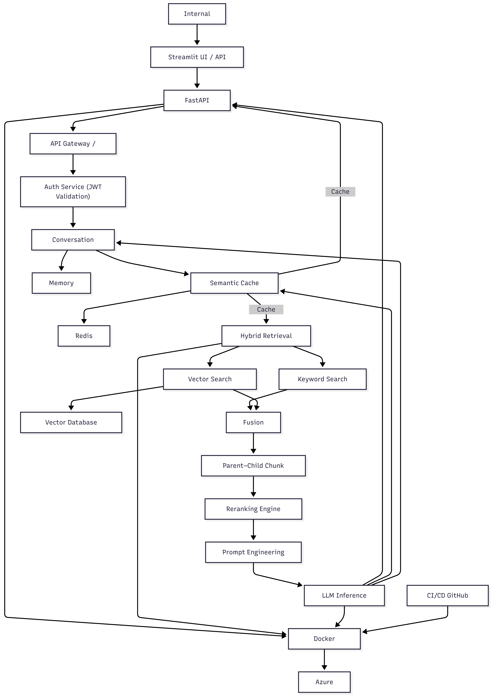

# SentinelRAG
**Enterprise-Grade Secure Knowledge Intelligence Platform**

## Table of Contents
- [Short Description](#short-description)
- [Problem Statement](#problem-statement)
- [Solution Overview](#solution-overview)
- [Key Capabilities](#key-capabilities)
- [System Architecture (High-Level)](#system-architecture-high-level)
- [Security Model](#security-model)
- [Evaluation & Benchmarking](#evaluation--benchmarking)
- [Tech Stack](#tech-stack)
- [Project Structure](#project-structure)
- [Running Locally](#running-locally)
- [Deployment](#deployment)
## Short Description
A production-grade, secure, role-based Retrieval-Augmented Generation (RAG) platform for internal enterprise knowledge systems. Features include RBAC enforcement, semantic caching, parent–child document retrieval, evaluation pipelines, and cloud-native deployment on Azure.

---
## Problem Statement

Modern enterprises store vast internal knowledge (HR policies, payroll, compliance, guidelines, procedures) across fragmented systems such as PDFs, shared drives, portals, and repositories.

As organizations scale, they face critical issues:

- **Knowledge Fragmentation**  
  Information is scattered across disconnected systems, making it hard to find accurate and authoritative answers quickly.

- **Access Control Gaps**  
  Different roles (employee, manager, HR) require different access levels, but existing systems fail to enforce fine-grained, role-based access at the data level, leading to unauthorized exposure risks.

- **Ineffective Retrieval**  
  Keyword-based search lacks semantic understanding, producing irrelevant results and poor precision.

- **Lack of Context Awareness**  
  Systems cannot understand user intent, conversation history, or multi-turn queries, resulting in repetitive and inefficient interactions.

- **Security & Compliance Risks**  
  Weak access enforcement leads to data leakage, policy violations, and compliance failures involving confidential information.

- **Operational Inefficiency**  
  Employees waste significant time searching for information, directly reducing productivity and efficiency.

- **Unreliable AI Systems**  
  Existing AI assistants lack evaluation, benchmarking, and validation mechanisms, making them unmeasurable and untrustworthy for enterprise use.

---

### Core Problem Summary
Enterprises lack a secure, intelligent, and role-aware internal knowledge system that enforces data-level access control, enables semantic and context-aware multi-turn retrieval, prevents unauthorized data exposure, delivers accurate and grounded answers, and operates with measurable reliability at production scale.

# Solution Overview

The solution is a secure, enterprise-grade internal knowledge platform that converts fragmented organizational documents into a centralized, role-aware knowledge layer accessible via natural language queries.

Built on a Retrieval-Augmented Generation (RAG) architecture, the system provides semantic, context-aware retrieval while enforcing strict data-level role-based access control. All responses are grounded in authorized internal documents, ensuring accuracy, security, and trust.

The platform supports multi-turn conversational interactions, delivers low-latency performance through optimized retrieval and caching, and includes evaluation and benchmarking mechanisms to ensure measurable reliability at production scale.

---

## Key Capabilities

### Secure Internal Knowledge Access
Provides controlled, authenticated access to internal organizational documents through a protected API layer.

### Role-Based Access Control (RBAC)
Enforces strict role-level access (employee, manager, HR) at the data, retrieval, cache, and response layers to prevent unauthorized information exposure.

### Semantic Knowledge Retrieval
Uses embedding-based retrieval to understand user intent and meaning, delivering accurate and relevant results beyond keyword search.

### Hybrid Retrieval Architecture
Combines dense vector search with sparse retrieval for improved recall and precision in document matching.

### Hierarchical Document Structure
Implements parent–child document modeling to preserve document structure and improve contextual coherence in answers.

### Context-Aware Conversational Memory
Supports multi-turn interactions using session memory and summarization for natural conversational access to internal knowledge.

### Role-Isolated Semantic Caching
Accelerates repeated queries through role-scoped semantic caching while maintaining strict data isolation between user roles.

### Enterprise-Grade Security Model
Integrates JWT authentication, RBAC enforcement, role-based filtering, and secure secret handling for production environments.

### Performance-Optimized Pipeline
Uses multi-layer caching, retrieval optimization, and threshold-based reranking to reduce latency and resource consumption.

### Evaluation & Benchmarking Framework
Includes built-in pipelines for latency measurement, retrieval evaluation, RBAC validation, and generation quality assessment.

### Cloud-Native Deployment
Designed for containerized deployment with cloud-native configuration and secure secret injection.

### Production-Ready Architecture
Built with modular components, fault tolerance, graceful degradation, and enterprise deployment practices.

# System Architecture (High-Level)

The system is designed as a secure, layered enterprise platform for internal knowledge access and intelligence.

At a high level, the architecture consists of the following logical layers:

## Client Layer
Internal users and applications interact with the system through a secure API interface.

## Secure API Layer
A protected FastAPI backend handles all incoming requests, authentication, and request validation.

## Identity & Access Layer
JWT-based authentication and role-based access control ensure that users can only access authorized knowledge.

## Knowledge Retrieval Layer
Internal documents are accessed through semantic and hybrid retrieval mechanisms, enabling intelligent knowledge discovery.

## Knowledge Structuring Layer
Parent–child document modeling preserves document hierarchy and ensures coherent context construction.

## AI Intelligence Layer
Retrieved knowledge is processed by AI models to generate grounded, context-aware responses.

## Caching & Memory Layer
Multi-layer caching and session memory optimize performance and enable conversational interaction.

## Infrastructure Layer
The system runs as a cloud-native, containerized service with secure configuration and secret management.

 

# Security Model

**Security is a core design principle of the system, not an afterthought.**

The platform is built to ensure that internal organizational knowledge is accessed only by authorized users, under strictly controlled conditions.

---

## Authentication
- **JWT-based Authentication**: The system uses JWT-based authentication for all protected API endpoints.
- **Organizational Credentials**: Users authenticate using valid organizational credentials.
- **Bearer Token Requirement**: Every request to the system requires a valid bearer token.

## Authorization (Role-Based Access Control)
- **RBAC Enforcement**: The system enforces role-based access control (RBAC) across all layers.
- **User Role Definitions**: User roles (employee, manager, HR) define access permissions.
- **Data-Level Control**: Access control is enforced at the data level, not just at the API level.

## Data-Level Role Isolation
- **Role-Access Tagging**: Internal documents are tagged with role-access flags.
- **Role-Based Filtering**: Retrieval operations filter knowledge based on user role.
- **Unauthorized Content Prevention**: Unauthorized documents are never retrieved, processed, cached, or sent to AI models.

## Secure Knowledge Access
- **Authorized Content Only**: Only authorized internal knowledge is used for answer generation.
- **Grounded Responses**: AI responses are grounded strictly in permitted internal content.
- **No External Sources**: No external knowledge sources are used.

## Secure Configuration Management
- **No In-Code Secrets**: Secrets and API keys are never stored in code.
- **Secure Injection**: All credentials are injected through secure environment variables.
- **Cloud-Native Management**: Cloud-native secret management is used in production environments.

## Cache Security
- **Role-Isolated Semantic Cache**: Semantic cache is role-isolated, preventing cross-role data leakage.
- **Session-Scoped Memory**: Session memory is scoped per user session.
- **Consistent Access Control**: Cached data respects the same access control rules as live retrieval.

## Infrastructure Security
- **Containerized Deployment**: Containerized deployment ensures environment isolation.
- **Cloud-Managed Security**: Cloud-managed services handle secure networking and runtime protection.
- **Restricted External Access**: External service access is restricted to required APIs only.

---

# Evaluation & Benchmarking

The system is built as a measurable, validated, and benchmarked enterprise platform, with structured evaluation pipelines covering retrieval quality, generation quality, security enforcement, and performance.

---

## 🔍 Retrieval Evaluation (RAG Quality)
**Metrics:**
- **Recall@5**: 0.951
- **Precision@5**: 0.277
- **MRR**: 0.806
- **Total Queries Evaluated**: 226

This demonstrates high recall and ranking quality, ensuring relevant internal documents are consistently retrieved for answer generation.

## 🧠 Generation Quality Evaluation
**Metrics:**
- **Average Faithfulness**: 0.832
- **Average Answer Relevance**: 4.65 / 5

This validates that generated responses remain grounded in internal knowledge and are contextually relevant.

## ⚡ System Level Performance & Latency Benchmarking
**End-to-End Latency:**
- **P50**: 1.52s
- **P95**: 2.52s
- **P99**: 3.96s
- **Average**: 1.69s

**Component Latency (Avg):**
- **Embedding**: 0.32s
- **Retrieval**: 0.18s
- **Reranker**: 0.09s

## 💰 Cost Efficiency
**Average Cost Per Query:**
- **~ $0.00146 USD**

This demonstrates production-grade cost efficiency for enterprise-scale usage.

## 🔐 Security Validation (RBAC)
**RBAC Evaluation Results:**
- **Total Attack Tests**: 297
- **Violations Found**: 0
- **Violation Rate**: 0.0000

This confirms strict role isolation and zero unauthorized data access.

---

## Evaluation Summary

The system is not only functional, but:
- ✅ **Measured**
- ✅ **Benchmarked**
- ✅ **Validated**
- ✅ **Audited**
- ✅ **Security-tested**
- ✅ **Performance-tested**
- ✅ **Production-verified**


# Tech Stack

## Backend & API
- **Python** – Core programming language
- **FastAPI** – Secure, high-performance API framework
- **Uvicorn** – ASGI server for production execution

## AI & Machine Learning
- **OpenAI** – Embeddings for semantic retrieval
- **Groq** – LLM inference engine
- **Cohere** – Reranking model for retrieval optimization
- **LangChain** – Prompt orchestration and memory integration

## Retrieval & Knowledge Infrastructure
- **Pinecone** – Vector database for semantic search
- **BM25 Encoder** – Sparse retrieval for hybrid search
- **Parent–Child Chunking Model** – Hierarchical document structuring

## Caching & Memory
- **Redis** – Semantic cache and session memory backend

## Security & Access Control
- **JWT Authentication** – Secure user authentication
- **Role-Based Access Control (RBAC)** – Fine-grained permission management
- **Role-Isolated Semantic Caching** – Secure caching with role separation

## Evaluation & Benchmarking
- **Python Evaluation Scripts** – Custom assessment tools
- **Jupyter Notebooks** – Analysis and experimentation
- **Automated Benchmarking Pipelines** – Continuous performance monitoring

## DevOps & Deployment
- **Docker** – Containerization
- **Azure App Service** – Cloud deployment platform
- **GitHub Actions** – CI/CD pipeline automation

## Configuration & Secrets
- **Environment Variables** – Runtime configuration
- **Cloud Secret Injection** – Secure credential management

# Project Structure

The repository follows a modular, enterprise-oriented structure designed for scalability, maintainability, security, and clear separation of responsibilities:

```plaintext
enterprise-internal-hr-knowledge-rag-main/
│
├── app/                             # Core application code
│   ├── auth/                        # Authentication & RBAC
│   │   ├── models.py                # Auth request/response models
│   │   ├── routes.py                # Login and auth APIs
│   │   └── users.py                 # User loading & RBAC data
│   │
│   ├── rag/                         # RAG pipeline & retrieval logic
│   │   ├── routes.py                # /ask and /ask_with_metrics APIs
│   │   ├── clients.py               # LLM, embeddings, retriever clients
│   │   └── parent_store.py          # Parent document storage
│   │
│   ├── cache/                       # Caching & memory layer
│   │   ├── memory.py                # Conversation memory & summarization
│   │   ├── semantic_cache.py        # Semantic caching logic
│   │   └── redis_client.py          # Redis connection handler
│   │
│   ├── core/                        # Core system services
│   │   ├── config.py                # Environment & secrets configuration
│   │   └── security.py              # JWT auth & security utilities
│   │
│   └── models/                      # Shared data models
│       └── query.py                 # Query request model
│
├── data/                            # Runtime system data
│   ├── users.xlsx                   # Internal user database
│   └── parent_chunks.jsonl          # Parent document store
│
├── eval_data/                       # Evaluation datasets
│   ├── generational_eval.jsonl
│   ├── latency_eval.jsonl
│   ├── retrieval_eval.jsonl
│   └── rbac_eval.jsonl
│
├── eval_scripts/                    # Evaluation execution scripts
│   ├── run_generation_eval.py
│   ├── run_latency_eval.py
│   ├── run_retrieval_eval.py
│   └── run_rbac_eval.py
│
├── evaluation/                      # Analysis, notebooks & reports
│   ├── generation_eval.ipynb
│   ├── latency_cost_eval.ipynb
│   ├── retrieval_eval.ipynb
│   ├── rbac_eval.ipynb
│   └── metrics_summary.md
│
├── .github/workflows/               # CI/CD pipelines
│   └── docker-build.yml
│
├── Dockerfile                       # Container build configuration
├── .dockerignore                    # Docker build exclusions
├── .gitignore                       # Git version control exclusions
├── requirements.txt                 # Python dependencies
├── main.py                          # Application entry point
└── README.md                        # Project documentation
```

# Running Locally

This section explains how to run the system in a local development environment for testing, development, and evaluation.

---

## Prerequisites
Ensure the following are installed:
- **Python 3.9+**
- **pip**
- **Redis** (local instance or cloud Redis)
- **Access to required API services:**
  - OpenAI
  - Groq
  - Pinecone
  - Cohere

## Step 1: Clone the Repository
```bash
git clone https://github.com/Tanish-analyst/enterprise-internal-hr-knowledge-rag.git
cd enterprise-internal-hr-knowledge-rag
```
### Step 2: Create Virtual Environment
```bash
python -m venv venv
source venv/bin/activate   # Linux/Mac
venv\Scripts\activate      # Windows
```

### Step 3: Install Dependencies
```bash
pip install -r requirements.txt
```

### Step 4: Configure Environment Variables
Create a .env file in the root directory:
```bash
# Security
SECRET_KEY=
ACCESS_TOKEN_EXPIRE_MINUTES=60

# AI Services
OPENAI_API_KEY=
GROQ_API_KEY=
COHERE_API_KEY=

# Retrieval
PINECONE_API_KEY=
PINECONE_INDEX=multi-rag-system

# Cache
REDIS_HOST=
REDIS_PORT=6379
REDIS_USERNAME=
REDIS_PASSWORD
```

### Step 5: Run the Application
``` bash
uvicorn main:app --reload
```
### Step 6: Access the API
- **API Base URL:**  
  `http://127.0.0.1:8000`
- **Interactive API Docs:**  
  `http://127.0.0.1:8000/docs`


#### Test User Credentials
For local testing and evaluation, user accounts are preloaded from: `data/users.xlsx`

This file contains 4000+ registered internal users with assigned roles:
- `employee`
- `manager`
- `hr`

  ---

#### Password Pattern (Testing Only)
For test users, the password format follows a deterministic pattern:

**Format:**
- **email:** `user<id>@company.com`
- **password:** `user<id>pass`

This pattern is used only for local testing and development.

# Deployment 
The system is designed for production-grade deployment using a containerized, cloud-native architecture.
**Core Characteristics:**
- Docker-based containerization
- Cloud-native deployment model
- Stateless API architecture
- Externalized configuration & secrets
- Secure secret injection
- CI/CD automation
- Infrastructure independence

**Cloud Model:**
- Containerized FastAPI service
- Cloud-managed runtime (Azure App Service)
- External AI services
- External vector database
- External cache backend

