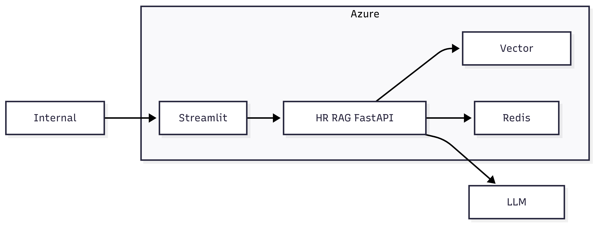

# Internal HR Knowledge RAG System

## High-Level Design (HLD)
**Author:** Tanish Sharma  
**Version:** 1.0  
**Status:** Final  

---

## 1. System Overview

### Purpose
The Internal HR Knowledge RAG System enables employees to query HR documents and receive accurate, context-aware responses using Retrieval-Augmented Generation (RAG).

### High-Level Description
Backend service built using **FastAPI**.

Users interact via:
- Direct API calls (current production)
- Streamlit UI (optional frontend layer)

System is deployed on **Microsoft Azure** using **Docker**.

Uses hybrid retrieval:
- Vector search
- Keyword search

Integrates with external LLM providers for answer generation.

Optimized for **low latency** using semantic caching.

### Key Components
- Client Layer – User / Streamlit UI
- API Layer – FastAPI backend
- Retrieval Layer – Pinecone + BM25
- Cache Layer – Redis semantic cache
- LLM Layer – Groq / OpenAI
- Cloud Layer – Azure infrastructure

### Key Characteristics
- Stateless REST APIs
- Secure access using JWT authentication
- Low latency response through caching
- Scalable cloud-native deployment
- Modular and extensible design

### Supported Capabilities
- HR policy Q&A
- Context-based response generation
- Role-based access control
- Latency monitoring (P50, P95, P99)

### System Context Diagram

---

## 2. Architecture Overview

### Architecture Style
The system follows a layered service architecture with clear separation across API, security, retrieval, and LLM layers.

### High-Level Flow

### Core Architectural Layers

#### Presentation Layer
- User / Streamlit UI
- Sends queries to backend APIs

#### API Layer
- FastAPI backend
- Handles routing and request validation

#### Security Layer
- JWT authentication
- Role-based access control (RBAC)

#### RAG Orchestration Layer
- Semantic cache (Redis)
- Hybrid retrieval engine
- Reranking and prompt formatting

#### Retrieval Layer
- Pinecone vector database
- BM25 keyword search
- Parent–child chunk mapping

#### LLM Layer
- Groq / OpenAI / Cohere
- Generates final response

### Key Architectural Principles
- Modular and loosely coupled layers
- Cloud-native design (Docker + Azure)
- Hybrid retrieval for higher accuracy
- Cache-first approach for low latency
- Provider-agnostic LLM integration

### Technology Stack
- Backend: FastAPI (Python)
- Vector DB: Pinecone
- Cache: Redis
- LLMs: Groq, OpenAI
- Deployment: Docker, Azure App Service

### Architecture Diagram

---

## 3. Data Flow

End-to-end request processing flow:

1. **User Request**
   - User submits query via Streamlit UI or API call
   - Request reaches FastAPI backend

2. **Authentication**
   - User credentials validated
   - JWT token verified
   - Unauthorized requests blocked

3. **Semantic Cache Check**
   - Redis semantic cache lookup  
   - Cache hit → immediate response  
   - Cache miss → forward for processing

4. **Conversation Memory Handling**
   - Session memory manager
   - Maintains:
     - Raw turns (TTL 300s)
     - Conversation summary
     - Short-term memory
     - Long-term summarized context

5. **Hybrid Retrieval**
   - Query sent to:
     - Pinecone (vector search)
     - BM25 (keyword search)
   - Results merged for increased accuracy

6. **Document Processing**
   - Retrieved child chunks mapped to parent docs
   - Ensures contextual retrieval

7. **Reranking**
   - Documents ranked by relevance
   - Top results selected

8. **Prompt Construction**
   - Prompt builder injects:
     - User query
     - Retrieved context
     - Conversation memory

9. **LLM Response**
   - Prompt sent to Groq LLM
   - Final answer generated

10. **Response Handling**
    - Response returned to user
    - Stored in semantic cache
    - Memory updated

### Data Flow Diagram
> (Insert data flow diagram here)

---

## 4. Deployment Architecture

### Deployment Model
Containerized cloud-native deployment on **Microsoft Azure** using **Docker**.

### Deployment Flow
1. Developers push code to GitHub
2. Automated pipeline builds Docker image
3. Image stored in Azure Container Registry (ACR)
4. Application deployed to Azure App Service
5. Users access via public Azure endpoint

### Core Components
- Source Control: GitHub
- Containerization: Docker
- Image Registry: Azure Container Registry
- Runtime Platform: Azure App Service (Containers)
- Cloud Provider: Microsoft Azure

### Key Characteristics
- Fully containerized deployment
- Cloud-managed infrastructure
- Horizontal scalability support
- Zero-downtime deployment support
- Production-grade hosting

### Deployment Diagram
> (Insert deployment diagram here)

---

## 5. CI/CD Architecture

### Pipeline Model
Fully automated CI/CD pipeline using **GitHub Actions**.

### Pipeline Flow
1. Code commit triggers pipeline
2. Build stage
3. Test stage
4. Docker image creation
5. Push to Azure Container Registry
6. Deploy to Azure App Service

### CI/CD Stages
- Build Stage – Code compilation & dependency resolution
- Test Stage – Automated validation
- Image Build Stage – Docker image creation
- Push Stage – Image push to ACR
- Deploy Stage – Auto-deployment to Azure

### Automation Benefits
- Zero manual deployment
- Fast release cycles
- Consistent builds
- Rollback-ready architecture
- Environment parity

### CI/CD Diagram
> (Insert CI/CD diagram here)

---

## 6. Security Architecture

### Security Model
Multi-layered security ensuring authentication, authorization, and secrets management.

### Authentication Flow
- User login via email & password
- Backend validates credentials
- JWT token issued
- Token used for secured API access

### Authorization Flow
- Role validation via JWT claims
- RBAC enforced
- Unauthorized access blocked

### Secrets Management
- Secrets stored in **Azure Key Vault**
- No secrets in source code
- Secure environment variable injection

### Security Layers
- Authentication layer
- Token layer (JWT)
- Authorization layer (RBAC)
- Infrastructure security (Azure isolation)
- Secrets management (Key Vault)

### Security Principles
- Zero-trust API access
- Least-privilege access model
- Encrypted token-based authentication
- Secure credential storage
- Cloud-native security controls

### Security Diagram
> (Insert security diagram here)

---

## 7. Scalability Architecture

### Current State
Running as a single instance on Azure App Service (student subscription) with autoscaling disabled to control cost.

### Scalability-Ready Design
- Stateless backend
- Dockerized deployment
- Shared state via Redis
- Cloud-native provisioning
- Horizontal scaling support

### Production-Ready Model
- Azure load balancer
- Multiple FastAPI replicas
- Central Redis cache
- Shared session memory
- Fault-tolerant configuration

### Scaling Strategy (Planned)
- CPU > 70% → Scale out
- Requests > 100/sec → Scale out
- CPU < 30% → Scale in

### Benefits
- High availability
- Fault tolerance
- Traffic spike handling
- Zero downtime scaling
- No code changes required

### Scalability Diagram
> (Insert scalability diagram here)

---

## 8. Observability

### Monitoring Model
Observability implemented using **LangSmith** for RAG + LLM tracing.

### LangSmith Captures
- Prompt inputs
- Model outputs
- Token usage
- Latency
- Tool calls

### Capabilities
- Prompt debugging
- Cost tracking
- Performance analysis
- Pipeline tracing

### Infrastructure Monitoring (Planned)
Using **Azure Monitor** for:
- CPU usage
- Memory usage
- Network metrics
- Container health

### Observability Diagram
> (Insert observability diagram here)
